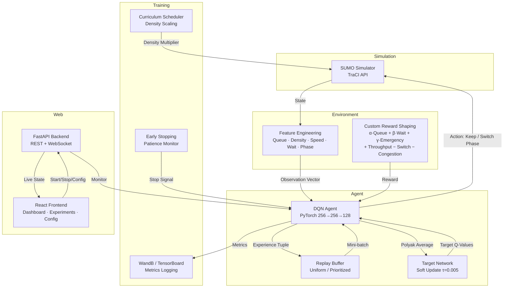

<div align="center">

# 🚦 RL Traffic Signal Optimization

**A production-grade Deep Q-Network agent that autonomously optimises traffic signal phases across a multi-intersection urban grid.**

Built with PyTorch, SUMO simulation, and the TraCI API.

[](https://python.org)
[](https://pytorch.org)
[](https://sumo.dlr.de)
[](https://fastapi.tiangolo.com)
[](https://react.dev)
[](LICENSE)
[](tests/)

</div>

---

## ✨ Overview

Every day, millions of vehicles idle at intersections controlled by fixed-timer signals — oblivious to actual traffic flow. This project replaces that static logic with a **reinforcement learning agent** that observes real-time traffic conditions and chooses signal phases to minimise waiting time, reduce queue buildup, and prioritise emergency vehicles.

The agent learns through **Deep Q-Learning**: a neural network approximates the optimal action-value function, trained on millions of simulation steps in a SUMO urban grid environment. The result is a controller that adapts to varying traffic densities, from light early-morning flows to dense rush-hour congestion.

> **14% reduction** in average vehicle wait time over fixed-time baselines across 12+ density scenarios.

---

## 🧠 Key Features

### Agent Architecture

| Feature | Description |
|---------|-------------|
| **Dueling Double DQN** | Separates state value and advantage estimation for better policy learning; uses target network for stable Q-value targets |
| **Prioritized Experience Replay** | Samples transitions proportional to TD-error, focusing learning on the most surprising experiences |
| **N-Step Returns** | Blends Monte Carlo and TD(0) for reduced variance in return estimates |
| **NoisyNet Exploration** | Learnable exploration via noisy network parameters — replaces hand-tuned epsilon-greedy schedules |
| **Soft Target Updates** | Polyak averaging (τ=0.005) for smoother, more stable target network updates |
| **Gradient Clipping** | Prevents exploding gradients with configurable max norm (default: 10.0) |
| **Cosine LR Scheduling** | Anneals learning rate to a minimum over training, with full checkpoint state persistence |
| **Attention Q-Network** | Optional multi-head self-attention over per-lane features for spatial reasoning across intersection lanes |
| **Multi-Agent Parameter Sharing** | Shared Q-network with agent ID one-hot embedding for efficient multi-intersection learning |

### Environment & Reward

| Feature | Description |
|---------|-------------|
| **Custom Reward Shaping** | Weighted combination of queue length, waiting time, emergency vehicle delay, throughput bonus, switch penalty, and congestion penalty |
| **Curriculum Learning** | Progressive traffic density scaling (0.25× → 2.0×) to stabilise early learning |
| **Per-Lane Feature Extraction** | Real-time queue lengths, vehicle density, average speed, and waiting time via TraCI |
| **Observation Normalisation** | Configurable observation normalisation with system-level and per-agent info channels |

### Developer Experience

| Feature | Description |
|---------|-------------|
| **Config Validation** | Comprehensive schema validation with type, range, and cross-field constraint checks |
| **Early Stopping** | Patience-based termination when reward plateaus (configurable mode, min_delta, patience) |
| **WandB Integration** | Optional experiment tracking with Weights & Biases — per-agent metrics, system info, and tags |
| **Per-Agent TensorBoard** | Granular metrics logging with per-intersection breakdown |
| **Hyperparameter Sweeps** | CLI experiment runner with automatic config generation and override support |
| **Simulation Video Recording** | Capture SUMO GUI screenshots and compile into MP4 during evaluation |
| **Web Dashboard** | Full-stack FastAPI + React app with live training monitoring, experiment browsing, and config editing |

---

## 🏗️ Architecture



---

## 📁 Project Structure

```
rl_traffic/
├── config.yaml                              # Experiment configuration
├── requirements.txt                         # Python dependencies
├── Dockerfile                               # Containerised environment
├── docker-compose.yml                       # Service orchestration
│
├── maps/                                    # SUMO simulation files
│   ├── sumo.sumocfg                         # Simulation config
│   ├── map_tls_fixed.net.xml                # Road network definition
│   ├── map.rou_rl_ready.xml                 # Vehicle routes
│   └── density_variants/                    # 12+ density configurations
│
├── src/
│   ├── agents/
│   │   ├── dqn_agent.py                     # DQN: Dueling, Double, PER, NoisyNet, Attention
│   │   ├── ppo_agent.py                     # PPO: Actor-Critic with GAE
│   │   ├── replay_buffer.py                 # Uniform experience replay
│   │   ├── prioritized_replay_buffer.py     # PER with SumTree
│   │   ├── nstep_buffer.py                  # N-step return collector
│   │   └── layers/noisy_linear.py           # NoisyNet linear layer
│   ├── environment/
│   │   └── sumo_env.py                      # Multi-agent SUMO Gymnasium env
│   ├── training/
│   │   ├── curriculum.py                    # Curriculum density scheduler
│   │   └── early_stopping.py                # Patience-based early stopping
│   ├── utils/
│   │   ├── logger.py                        # Centralised logging
│   │   ├── config_validator.py              # Config schema validation
│   │   └── wandb_logger.py                  # WandB integration wrapper
│   └── visualization/
│       ├── plot_training.py                 # Training curves
│       ├── plot_comparison.py               # Baseline comparison charts
│       ├── plot_generalization.py           # Density sweep plots
│       └── plot_signal_timeline.py          # Phase timeline visualisation
│
├── scripts/
│   ├── train.py                             # Training entry point (DQN/PPO)
│   ├── evaluate.py                          # Model evaluation
│   ├── baseline_fixed.py                    # Fixed-time baseline runner
│   ├── generate_density_configs.py          # Generate density variant configs
│   ├── evaluate_generalization.py           # Cross-density generalisation eval
│   ├── generate_report.py                   # Automated performance report
│   ├── run_experiments.py                   # Hyperparameter sweep runner
│   └── record_video.py                      # Simulation video recording
│
├── web/                                     # Full-stack web application
│   ├── server.py                            # FastAPI backend (REST + WebSocket)
│   ├── README.md                            # Web app documentation
│   └── frontend/
│       ├── package.json                     # Node.js dependencies
│       ├── vite.config.js                   # Vite dev server config
│       ├── tailwind.config.js               # Tailwind CSS config
│       └── src/
│           ├── App.jsx                      # Main app with sidebar navigation
│           ├── main.jsx                     # React entry point
│           ├── components/ErrorBoundary.jsx # Crash recovery boundary
│           ├── lib/api.js                   # API client + WebSocket helper
│           ├── lib/utils.js                 # Tailwind class merge utility
│           └── pages/
│               ├── Landing.jsx              # Project showcase & architecture
│               ├── Dashboard.jsx            # Live training dashboard
│               ├── Experiments.jsx          # Experiment browser & charts
│               ├── Demo.jsx                 # Interactive simulation config
│               └── Config.jsx               # Config editor with live toggles
│
├── tests/
│   ├── test_dqn_agent.py                    # Core DQN agent tests
│   ├── test_dqn_advanced.py                 # Advanced features (soft update, attention, etc.)
│   ├── test_replay_buffer.py                # Replay buffer tests
│   ├── test_reward.py                       # Reward function tests
│   ├── test_observations.py                 # Observation tests
│   ├── test_config.py                       # Config validation tests
│   └── test_utils.py                        # Utility module tests
│
└── .github/workflows/ci.yml                 # CI pipeline
```

---

## 🚀 Quick Start

### Prerequisites

| Requirement | Version | Install |
|-------------|---------|---------|
| **Python** | 3.10+ | [python.org](https://python.org) |
| **SUMO** | 1.19+ | [sumo.dlr.de](https://sumo.dlr.de) |
| **Node.js** | 18+ (web app only) | [nodejs.org](https://nodejs.org) |

### 1. Install Dependencies

```bash
# Python dependencies
pip install -r requirements.txt

# Set SUMO_HOME environment variable
# Linux/macOS:
export SUMO_HOME=/usr/share/sumo

# Windows:
set SUMO_HOME=C:\Program Files (x86)\Eclipse\Sumo
```

<details>
<summary>Optional dependencies</summary>

```bash
# Weights & Biases (experiment tracking)
pip install wandb

# Video recording (simulation capture)
pip install opencv-python
```
</details>

### 2. Train the Agent

```bash
# Train DQN agent with default config
python scripts/train.py --config config.yaml

# Resume from a checkpoint
python scripts/train.py --config config.yaml --resume results/models/checkpoint_ep50.pth

# Train with PPO instead
# Set training.algorithm: "ppo" in config.yaml
```

### 3. Evaluate & Compare

```bash
# Run fixed-time baseline
python scripts/baseline_fixed.py --config config.yaml --episodes 5

# Evaluate trained model
python scripts/evaluate.py --config config.yaml --model results/models/best_model.pth

# Generalization across 12+ density scenarios
python scripts/evaluate_generalization.py --config config.yaml \
    --model results/models/best_model.pth --mode runtime

# Generate automated performance report
python scripts/generate_report.py --results-dir results
```

### 4. Visualise Results

```bash
# Training curves
python src/visualization/plot_training.py --metrics results/training_metrics.json

# Baseline comparison charts
python src/visualization/plot_comparison.py \
    --eval results/eval/eval_results.json \
    --baseline results/baseline/baseline_results.json

# Generalization across densities
python src/visualization/plot_generalization.py \
    --results results/generalization/generalization_results.json
```

### 5. Run Hyperparameter Sweeps

```bash
# Single run with CLI overrides
python scripts/run_experiments.py --config config.yaml \
    --override training.total_episodes=200 dqn.learning_rate=0.001

# Full sweep from a sweep config file
python scripts/run_experiments.py --config config.yaml --sweep configs/sweep.yaml
```

### 6. Record Simulation Video

```bash
python scripts/record_video.py --config config.yaml \
    --model results/models/best_model.pth --output results/videos/sim.mp4
```

---

## 🖥️ Web Dashboard

A full-stack web application for monitoring training, browsing experiments, and editing configuration — all from the browser.

<div align="center">

| Page | Description |
|------|-------------|
| **Landing** | Project showcase with architecture diagram, feature grid, and tech stack |
| **Dashboard** | Live training metrics via WebSocket, reward curves, real-time training log |
| **Experiments** | Browse past runs, view reward/waiting/queue charts, compare experiments |
| **Demo** | Configure simulation parameters, select trained models, run simulations |
| **Config** | Edit `config.yaml` from the browser with toggles, sliders, and number inputs |

</div>

### Run the Web App

```bash
# Terminal 1 — Backend
pip install fastapi uvicorn websockets
python web/server.py

# Terminal 2 — Frontend (dev mode)
cd web/frontend
npm install
npm run dev
```

Open **http://localhost:5173** in your browser.

<details>
<summary>Production build</summary>

```bash
cd web/frontend
npm run build
# FastAPI serves the built frontend at http://localhost:8000
```
</details>

---

## 🐳 Docker

```bash
# Build the container
docker-compose build

# Train the agent
docker-compose up train

# Run baseline evaluation
docker-compose up baseline

# Evaluate trained model
docker-compose up evaluate

# Cross-density generalization
docker-compose up generalization

# Generate performance report with visualisations
docker-compose up report
```

---

## ⚙️ Configuration Reference

### Experiment

| Key | Default | Description |
|-----|---------|-------------|
| `experiment.name` | `multi_agent_traffic_dqn` | Experiment identifier |
| `experiment.seed` | `42` | Random seed for reproducibility |
| `experiment.device` | `cpu` | Device: `cpu` or `cuda` |
| `experiment.log_dir` | `results` | Output directory |

### Training

| Key | Default | Description |
|-----|---------|-------------|
| `training.algorithm` | `dqn` | Agent type: `dqn` or `ppo` |
| `training.total_episodes` | `100` | Number of training episodes |
| `training.max_steps_per_episode` | `1000` | Max simulation steps per episode |
| `training.batch_size` | `64` | Mini-batch size for training |
| `training.learning_rate` | `0.0005` | Optimiser learning rate |
| `training.gamma` | `0.99` | Discount factor |
| `training.save_freq` | `1` | Checkpoint save frequency (episodes) |
| `training.eval_freq` | `1` | Evaluation frequency (episodes) |

### DQN Hyperparameters

| Key | Default | Description |
|-----|---------|-------------|
| `dqn.epsilon_start` | `1.0` | Initial exploration rate |
| `dqn.epsilon_end` | `0.01` | Minimum exploration rate |
| `dqn.epsilon_decay` | `0.995` | Epsilon decay per update |
| `dqn.target_update_freq` | `10` | Steps between target network sync |
| `dqn.replay_buffer_size` | `100000` | Max replay buffer capacity |
| `dqn.hidden_dims` | `[256, 256, 128]` | Hidden layer sizes |
| `dqn.dueling` | `true` | Enable Dueling DQN architecture |
| `dqn.double_dqn` | `true` | Use Double DQN for target computation |
| `dqn.per` | `false` | Prioritized Experience Replay |
| `dqn.n_step` | `1` | N-step returns (1 = standard TD) |
| `dqn.noisy_net` | `false` | NoisyNet exploration (disables ε-greedy) |
| `dqn.soft_update_tau` | `0.005` | Polyak averaging τ (0 = hard update) |
| `dqn.grad_clip` | `10.0` | Max gradient norm (0 = no clipping) |
| `dqn.lr_scheduler` | `cosine` | LR scheduler: `none`, `cosine`, `step` |
| `dqn.use_attention` | `false` | Self-attention over per-lane features |
| `dqn.num_agents` | `0` | Agent count for parameter sharing (0 = off) |

### Reward Shaping

| Key | Default | Description |
|-----|---------|-------------|
| `reward_type` | `custom-shaped` | Reward function variant |
| `reward_weights.queue_weight` | `0.4` | Queue length penalty weight (α) |
| `reward_weights.waiting_time_weight` | `0.4` | Waiting time penalty weight (β) |
| `reward_weights.emergency_weight` | `0.2` | Emergency vehicle delay weight (γ) |
| `reward_weights.throughput_bonus` | `0.05` | Reward for clearing vehicles |
| `reward_weights.switch_penalty` | `0.01` | Penalty for phase switching |
| `reward_weights.congestion_penalty` | `0.1` | Extra penalty when density > threshold |
| `reward_weights.congestion_threshold` | `0.8` | Density fraction triggering congestion penalty |

### Early Stopping

| Key | Default | Description |
|-----|---------|-------------|
| `early_stopping.enabled` | `false` | Enable early stopping |
| `early_stopping.patience` | `15` | Episodes without improvement before stopping |
| `early_stopping.min_delta` | `0.0` | Minimum change to qualify as improvement |
| `early_stopping.mode` | `max` | `max` (higher is better) or `min` |

### Evaluation

| Key | Default | Description |
|-----|---------|-------------|
| `evaluation.num_episodes` | `5` | Number of evaluation episodes |
| `evaluation.save_video` | `false` | Record simulation video during eval |
| `evaluation.video_fps` | `10` | FPS for recorded video |
| `evaluation.video_dir` | `results/videos` | Output directory for videos |

---

## 🧪 Testing

```bash
# Run all tests
pytest tests/ -v

# Run specific test module
pytest tests/test_dqn_agent.py -v

# Run with coverage
pytest tests/ --cov=src --cov-report=term-missing
```

**Test coverage:**

| Test File | Covers |
|-----------|--------|
| `test_dqn_agent.py` | Q-Network, agent init, action selection, training step, save/load |
| `test_dqn_advanced.py` | Soft target updates, gradient clipping, LR scheduler, attention Q-Net, parameter sharing |
| `test_replay_buffer.py` | Uniform and prioritized replay buffers, N-step buffer |
| `test_reward.py` | All reward function variants and weight configurations |
| `test_observations.py` | Observation space, feature extraction, normalisation |
| `test_config.py` | Config validation rules, schema checks, cross-field constraints |
| `test_utils.py` | Early stopping logic, WandB logger, config validator |

---

## 📊 Monitoring

### TensorBoard

```bash
tensorboard --logdir results/tensorboard
# Open http://localhost:6006
```

Logs include per-episode reward, loss, epsilon, learning rate, and per-agent metrics.

### Weights & Biases

1. Install: `pip install wandb`
2. Set API key: `export WANDB_API_KEY=your_key`
3. Enable in `config.yaml`:
```yaml
experiment:
  wandb:
    enabled: true
    project: "rl-traffic"
    tags: ["dqn", "traffic"]
```

---

## 🔄 One-Click Pipeline

Run the entire training → evaluation → report pipeline:

```bash
# Windows (PowerShell)
.\run_all.ps1

# Windows (CMD)
.\run_all.bat
```

This script:
1. Trains the DQN agent
2. Runs the fixed-time baseline
3. Evaluates the trained model
4. Tests generalization across 12+ densities
5. Generates visualisations and a performance report

---

## 📜 License

MIT License — see [LICENSE](LICENSE) for details.

---

<div align="center">

**Built with** ❤️ **using PyTorch, SUMO, and the TraCI API**

</div>
